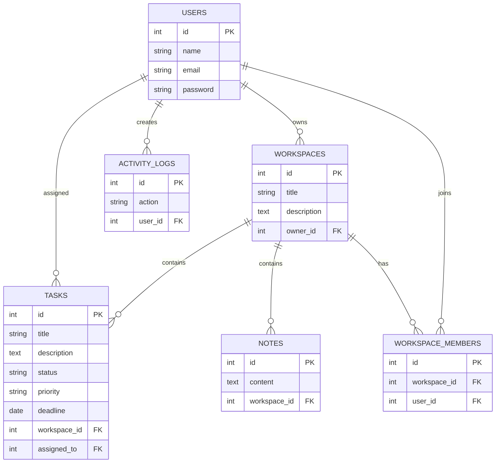

# FlowBoard ER Diagram

```mermaid
erDiagram

    USERS {
        int id PK
        string name
        string email
        string password
    }

    WORKSPACES {
        int id PK
        string title
        text description
        int owner_id FK
    }

    TASKS {
        int id PK
        string title
        text description
        string status
        string priority
        date deadline
        int workspace_id FK
        int assigned_to FK
    }

    NOTES {
        int id PK
        text content
        int workspace_id FK
    }

    WORKSPACE_MEMBERS {
        int id PK
        int workspace_id FK
        int user_id FK
    }

    ACTIVITY_LOGS {
        int id PK
        string action
        int user_id FK
    }

    USERS ||--o{ WORKSPACES : owns
    USERS ||--o{ TASKS : assigned
    USERS ||--o{ ACTIVITY_LOGS : creates

    WORKSPACES ||--o{ TASKS : contains
    WORKSPACES ||--o{ NOTES : contains
    WORKSPACES ||--o{ WORKSPACE_MEMBERS : has

    USERS ||--o{ WORKSPACE_MEMBERS : joins
```